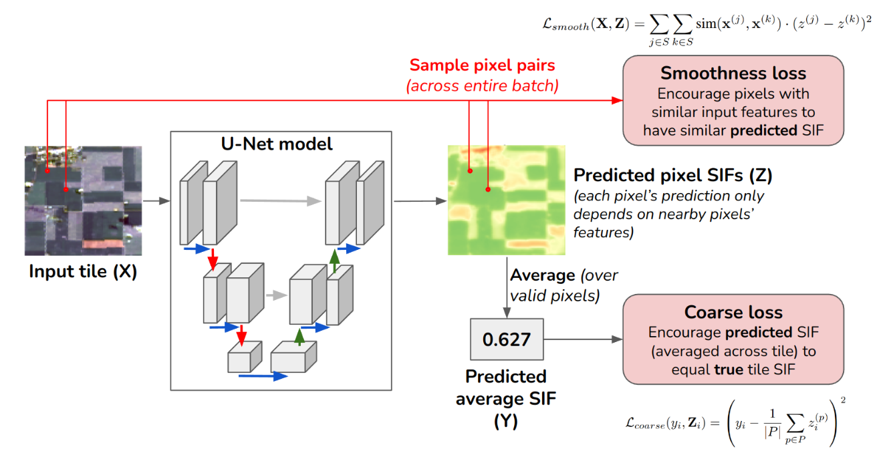

# "Monitoring Vegetation at Extremely Fine Resolutions via Coarsely-Supervised Smooth U-Net Regression"

This repository provides example code for CS-SUNet (Coarsely-Supervised Smooth U-Net Regression),
a technique for coarsely-supervised regression (inputs are available at fine-resolution, labels are
only at coarse-resolution, but we want to predict labels at fine-resolution). See the [paper](https://arxiv.org/pdf/2207.08022.pdf) for details.

To train CS-SUNet in a coarsely-supervised way, `run_train.sh` provides example usage. The 
main file for that is `train.py`.

Other experimental settings:

- `run_train_pixel_nn.sh` trains a per-pixel MLP

- `run_train_vanilla_unet.sh` trains more vanilla U-Net approaches without smoothness loss or early stopping.

To evaluate a deep model at a fine resolution, see `run_eval.sh` and `eval.py`.

To train averaging-based baselines and test them at a fine resolution, see `train_downscaling_averages.py`

# Installation instructions (not complete, TODO)

You need to install PyTorch/Torchvision, Numpy, Pandas, Matplotlib, Scikit-Learn, and maybe others. TODO - make this reproducible

    conda create --name sif
    conda activate sif
    conda install numpy pandas matplotlib scikit-learn
    conda install pytorch torchvision torchaudio pytorch-cuda=11.7 -c pytorch -c nvidia
    conda install -c conda-forge tqdm
